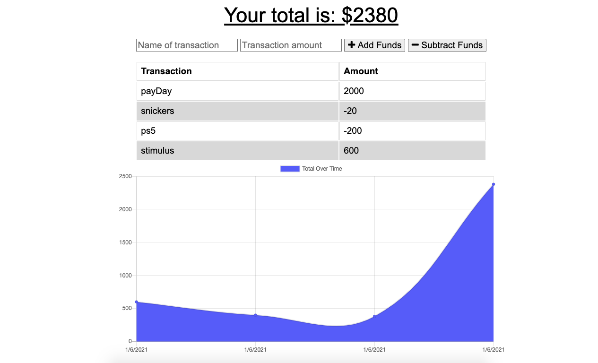

# PWA_Budget_Tracker
A simple progressive web app that allows an individual to track their expenses and see what their total deficit/surplus is.

# Description 
I had no idea what a Progressive Web App was, but this project taught me that it is an app that works both on and offline. This app is a progressive webapp that allows 
an individual to track their budget both on and offline. This project was a great deep dive into some great web and browser technologies such as indexedDB and using 
server-workers and manifest jsons, as well as learning about how to make our apps more performant. 

# Usage 

When an user is online they can add either expenses or deposits to their budget and this updates the total and updates the graph as well. When a user is offline they can do the same thing and when it comes back online the page updates with the information that was entered offline. 

# Tech Used 

* Node.js
* Express.js
* Indexed.db
* service worker/manifest.json
* mongo.db/Heroku 
* compression
* morgan 

# ScreenShot 

# Link to deployed Heroku App
[Click Here](https://mysterious-dusk-55844.herokuapp.com/) to access deployed heroku app. 

